<h1 align="center">🌾 windots</h1>

<div align="center">
  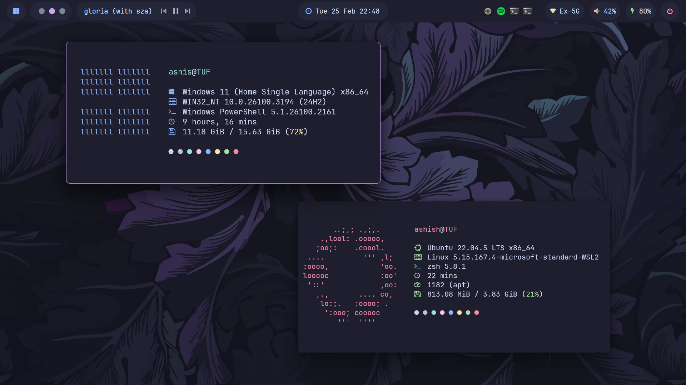
</div>

<div align="center">
  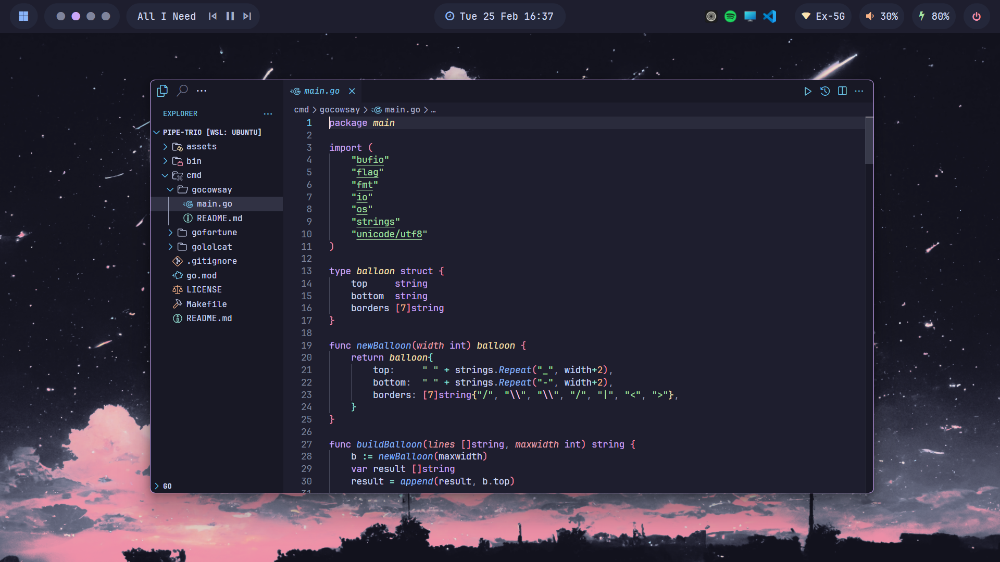
  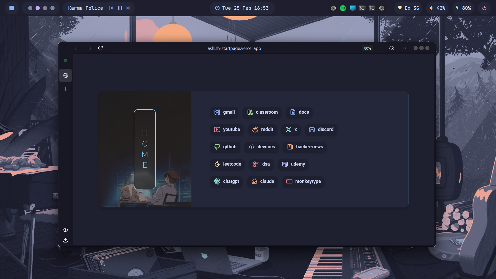
</div>

<div align="center">
  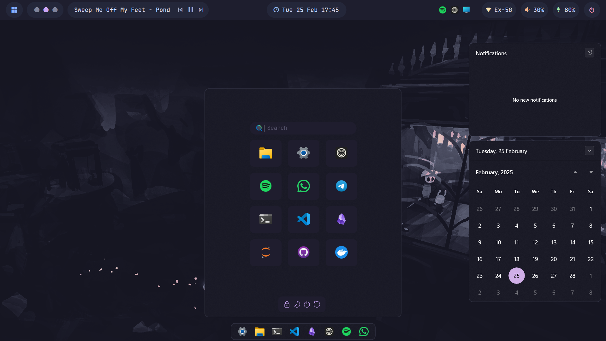
  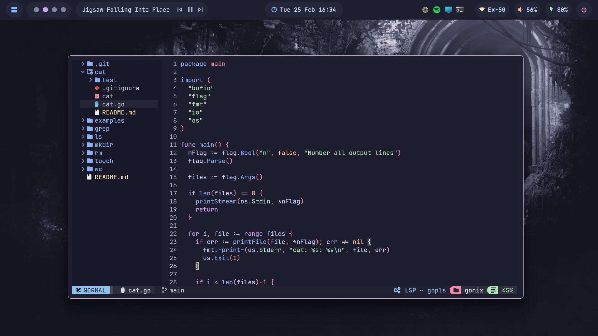
</div>

---

## 🌷 About

Hey there! 👋

Welcome to **windots**! This repo contains dotfiles for my Windows environment, designed for users who want a riced, Unix-like experience on Windows.

I created this to transform my Windows environment into something cleaner and more *Unix-y*. Whether it's for a tiling window manager, terminal customization, or smoother workflows, everything here is aimed at making Windows feel less like a chore and more efficient to work with.

If you're into [**r/unixporn**](https://reddit.com/r/unixporn)-style setups and want something similar on Windows, this might just help you get started!

> [!NOTE]
> All configurations related to my **Linux environment (WSL2)** are maintained in a separate repository: [**dotfiles**](https://github.com/ashish0kumar/dotfiles)

## ✨ Features

- 🪟 **GlazeWM** setup
- ❄️ Beautiful **YASB** config
- 🌸 Minimal **VSCode** and **Zed** setups
- \>_ Sleek **Windows Terminal** config
- 🐚 **PowerShell** config
- 🎨 **Oh My Posh** theme
- ⚙️ Minimal **Fastfetch** config
- 🚀 **Flow Launcher** config
- 🦅 Themeable **Start menu, Taskbar and Notification center**
- 💫 Beautiful [**Wallpapers**](https://github.com/ashish0kumar/windots/tree/main/walls#readme)
- 🐈 [**Catppuccin**](https://github.com/catppuccin) everywhere

---

## 🌸 Core System Info

- **OS:** [Windows 11](https://www.microsoft.com/en-in/windows/windows-11) 🪟 + [WSL2](https://learn.microsoft.com/en-us/windows/wsl/) 🐧
- **WM:** [GlazeWM](https://github.com/glzr-io/glazewm) ✨
- **Shell:** [PowerShell](https://learn.microsoft.com/en-us/powershell/) / [zsh](https://zsh.sourceforge.io/) 🐚
- **Terminal Emulator:** [Windows Terminal](https://github.com/microsoft/terminal) >_
- **Panel:** [YASB](https://github.com/amnweb/yasb) ❄️
- **Text Editor:** [Zed](https://zed.dev/) / [neovim](https://neovim.io/) ⌨️
- **App Launcher:** [Flow Launcher](https://www.flowlauncher.com/) 🚀
- **File Manager:** [File Explorer](https://www.microsoft.com/en-us/windows/tips/file-explorer) / [yazi](https://yazi-rs.github.io/) 📂
- **Browser:** [Zen-Browser](https://zen-browser.app) 🌐
- **Colorscheme:** [Catppuccin](https://catppuccin.com/) 🎨

---

### ℹ️ Whole System Info

Here is all the information about my setup:

> [!NOTE]
> Some of these apps have the **config files** included in the repo, which are marked with ⚙️  
> Also, my **favorite programs and tools** are marked with 💖

<details>
	
<summary>🪟 <b>System</b></summary>

<br>

| 📚 Entry                           	 | ✨ App                  |
|----------------------------------------|--------------------------|
| **OS** 				 				 | [Windows 11](https://www.microsoft.com/en-in/windows/windows-11) + [WSL2](https://learn.microsoft.com/en-us/windows/wsl/) |
| **Window Manager** 			 		 | 💖 [GlazeWM](https://github.com/glzr-io/glazewm) [⚙️](https://github.com/ashish0kumar/windots/blob/main/.config/glazewm/config.yaml) |
| **Bar** 				 				 | 💖 [YASB](https://github.com/amnweb/yasb) [⚙️](https://github.com/ashish0kumar/windots/blob/main/.config/yasb/) |
| **Application Launcher** 		 		 | [Flow Launcher](https://www.flowlauncher.com/) [⚙️](https://github.com/ashish0kumar/windots/blob/main/.config/FlowLauncher/settings.json) |
| **Mods** 				 				 | 💖 [Windhawk](https://windhawk.net/) [⚙️](https://github.com/ashish0kumar/windots/blob/main/.config/windhawk/) |

</details>

<details>
	
<summary>🖥️ <b>CLI/TUI Apps</b> </summary>

<br>

Configs for these can be found in [**dotfiles**](https://github.com/ashish0kumar/dotfiles)

| 📚 Entry                           	 | ✨ App                  |
|----------------------------------------|--------------------------|
| **Shell**                              | 💖 [zsh](https://zsh.sourceforge.io/) [⚙️](https://github.com/ashish0kumar/dotfiles/blob/main/.zshrc) / [pwsh](https://learn.microsoft.com/en-us/powershell/module/microsoft.powershell.core/about/about_pwsh?view=powershell-7.4) [⚙️](https://github.com/ashish0kumar/windots/blob/main/.config/WindowsPowershell/Microsoft.PowerShell_profile.ps1) |
| **Terminal Emulator**                  | [Windows Terminal](https://github.com/microsoft/terminal) [⚙️](https://github.com/ashish0kumar/windots/blob/main/.config/terminal/settings.json) |
| **Terminal Multiplexer**               | 💖 [tmux](https://github.com/tmux/tmux) [⚙️](https://github.com/ashish0kumar/dotfiles/blob/main/.config/tmux/tmux.conf) |
| **Shell Prompt**                       | [ohmyposh](https://ohmyposh.dev/) [⚙️](https://github.com/ashish0kumar/windots/blob/main/.config/ohmyposh/zen.toml) |
| **Text Editor**                        | 💖 [neovim](https://neovim.io/) [⚙️](https://github.com/ashish0kumar/dotfiles/tree/main/.config/nvim) |
| **CD Replacement**                     | 💖 [zoxide](https://github.com/ajeetdsouza/zoxide) |
| **LS Replacement**                     | [eza](https://github.com/eza-community/eza) |
| **Cat Replacement**                    | [bat](https://github.com/sharkdp/bat) [⚙️](https://github.com/ashish0kumar/dotfiles/tree/main/.config/bat) |
| **File Manager**                       | 💖 [yazi](https://yazi-rs.github.io/) [⚙️](https://github.com/ashish0kumar/dotfiles/tree/main/.config/yazi) |
| **Fuzzy File Finder**                  | 💖 [fzf](https://github.com/junegunn/fzf) |
| **Git**                                | [git](https://git-scm.com/) [⚙️](https://github.com/ashish0kumar/dotfiles/tree/main/.config/git) |
| **Git TUI**                            | [lazygit](https://github.com/jesseduffield/lazygit) |
| **System Monitor**                     | [btop](https://github.com/aristocratos/btop) [⚙️](https://github.com/ashish0kumar/dotfiles/blob/main/.config/btop/btop.conf) & [bottom](https://github.com/ClementTsang/bottom) [⚙️](https://github.com/ashish0kumar/dotfiles/blob/main/.config/bottom/bottom.toml) |
| **System Fetch**                       | [fastfetch](https://github.com/fastfetch-cli/fastfetch) [⚙️](https://github.com/ashish0kumar/dotfiles/blob/main/.config/fastfetch/config.jsonc) |
| **Audio Visualizer** 			 		 | [cava](https://github.com/karlstav/cava) |

</details>

<details>
	
<summary>🖱️ <b>GUI Apps</b></summary>

<br>

| 📚 Entry                           	 | ✨ App                  |
|----------------------------------------|--------------------------|
| **Text Editor**              		     | 💖 [Zed](https://zed.dev/) [⚙️](https://github.com/ashish0kumar/windots/blob/main/.config/zed/settings.json)  / [VSCode](https://code.visualstudio.com/) [⚙️](https://github.com/ashish0kumar/windots/blob/main/.config/vscode/settings.json) |
| **Music Player**                       | [Spotify](https://open.spotify.com/) (patched with [Spicetify](https://spicetify.app/)) |
| **Web Browser**               	 	 | 💖 [Zen-Browser](https://zen-browser.app) [⚙️](https://github.com/ashish0kumar/windots/blob/main/.config/browser/) 🏡 [startpage](https://github.com/ashish0kumar/startpage) |
| **Note Taking App**                    | 💖 [Obsidian](https://obsidian.md/) |
| **File Manager**                       | [File Pilot](https://filepilot.tech/) |
| **Office Apps**                     	 | [LibreOffice](https://www.libreoffice.org/) |

</details>
 
<details>
	
<summary>🔍 <b>Other</b></summary>

<br>

| 📚 Entry                              | ✨ App                  |
|---------------------------------------|--------------------------|
| **Colorscheme**                       | 💖 [Catppuccin Mocha](https://catppuccin.com) |
| **Font**                  			| [JetBrainsMono Nerd Font](https://www.jetbrains.com/lp/mono/) |

</details>
 
---

## 🔧 Setup

> [!WARNING]
> These configs are **not plug-and-play**  
> Cherry-pick what you need. Backup before applying.

<details>
<summary><strong>🪟 GlazeWM</strong></summary><br>

**NOTE:** Uses **YASB**, not Zebar.

- Install [GlazeWM](https://github.com/glzr-io/glazewm/releases)
- [`.config/glazewm/config.yaml`](.config/glazewm/config.yaml)

</details>

<details>
<summary><strong>🍫 YASB</strong></summary><br>

**NOTE:** Requires a Nerd Font (JetBrainsMono Nerd Font recommended).

- Install [YASB](https://github.com/amnweb/yasb/releases)
- [`.config/yasb/`](.config/yasb/)

</details>

<details>
<summary><strong>📝 Zed</strong></summary><br>

- Install [Zed](https://zed.dev)
- [`.config/zed/settings.json`](.config/zed/settings.json)

</details>

<details>
<summary><strong>⌨️ VSCode</strong></summary><br>

**WARNING:** Using **VSCode v1.91.1**  
(Newer versions do **not** support APC Customize UI)

- Install [VSCode](https://code.visualstudio.com/download)
- [APC Customize UI++](https://marketplace.visualstudio.com/items?itemName=drcika.apc-extension)  
- [`.config/vscode/settings.json`](.config/vscode/settings.json)

</details>

<details>
<summary><strong>🌐 Browser</strong></summary><br>

**NOTE:** Works only on Firefox-based browsers.

1. Enable stylesheets:
   - Open `about:config`
   - Set `toolkit.legacyUserProfileCustomizations.stylesheets = true`

2. Locate profile folder:
   - Open `about:support`
   - Click **Open Folder** next to Profile Folder

3. Copy configs:
   - [`.config/browser/userChrome.css`](.config/browser/userChrome.css)
   - [`.config/browser/userContent.css`](.config/browser/userContent.css)

</details>

<details>
<summary><strong>🚀 Flow Launcher</strong></summary><br>

- Install [Flow Launcher](https://www.flowlauncher.com)
- [`.config/FlowLauncher/settings.json`](.config/FlowLauncher/settings.json)

</details>

<details>
<summary><strong>🦅 Windhawk</strong></summary><br>

- Install [Windhawk](https://windhawk.net)
- Required mods:
  - Notification Center Styler
  - Start Menu Styler
  - Taskbar Styler

- [`.config/windhawk/`](.config/windhawk/)

Paste configs via:  
**Mod → Advanced → Mod Settings → Load**

</details>

<details>
<summary><strong>>_ Windows Terminal</strong></summary><br>

- Install [Windows Terminal](https://github.com/microsoft/terminal)
- [`.config/terminal/settings.json`](.config/terminal/settings.json)  

</details>

<details>
<summary><strong>🐚 PowerShell</strong></summary><br>

- Install [PowerShell](https://learn.microsoft.com/en-us/powershell/scripting/install/install-powershell?view=powershell-7.5)
- [`.config/WindowsPowershell/Microsoft.PowerShell_profile.ps1`](.config/WindowsPowershell/Microsoft.PowerShell_profile.ps1)

</details>

<details>
<summary><strong>🎨 Oh My Posh</strong></summary><br>

- Install:
  ```bash
  winget install JanDeDobbeleer.OhMyPosh -s winget
  ```

- [`.config/ohmyposh/zen.toml`](.config/ohmyposh/zen.toml)

Theme init is already included in the PowerShell profile.

</details> 

<details> 
<summary><strong>⚙️ Fastfetch</strong></summary><br>

- Install:
  ```bash
  winget install fastfetch
  ```

- [`.config/fastfetch/config.jsonc`](.config/fastfetch/config.jsonc)
- [`.config/fastfetch/windows.txt`](.config/fastfetch/windows.txt)

</details>

---

## ⌨️ Keybindings 

You can always change these in your `.glzr\glazewm\config.yaml`

### 🪟 Window Management & Navigation

| Keys                                    | Action                                                        |
|----------------------------------------|---------------------------------------------------------------|
| <kbd>alt</kbd> + <kbd>h \| j \| k \| l</kbd>                   | Focus window left \| down \| up \| right                     |
| <kbd>alt</kbd> + <kbd>shift</kbd> + <kbd>h \| j \| k \| l</kbd>  | Move focused window left \| down \| up \| right              |
| <kbd>alt</kbd> + <kbd>q</kbd>         | Close focused window                                         |
| <kbd>alt</kbd> + <kbd>1 - 9</kbd>     | Focus workspace {n}                                         | 
| <kbd>alt</kbd> + <kbd>shift</kbd> + <kbd>1 - 9</kbd>            | Move focused window to workspace {n}                         |
| <kbd>alt</kbd> + <kbd>m</kbd>         | Toggle window minimization                                  |
| <kbd>alt</kbd> + <kbd>f</kbd>         | Toggle window maximization                                  |
| <kbd>alt</kbd> + <kbd>v</kbd>         | Change tiling direction                                     |
| <kbd>alt</kbd> + <kbd>t</kbd>         | Toggle floating/tiled window state                          |
| <kbd>alt</kbd> + <kbd>shift</kbd> + <kbd>e</kbd>                | Exit GlazeWM                                                |

### 🚀 Custom App & Browser Shortcuts

| Keys                              | Action              | Keys                          | Action                     |
| --------------------------------- | ------------------- | ----------------------------- | -------------------------- |
| <kbd>alt</kbd> + <kbd>enter</kbd> | Open Terminal (WSL) | <kbd>alt</kbd> + <kbd>p</kbd> | Open Terminal (PowerShell) |
| <kbd>alt</kbd> + <kbd>e</kbd>     | Open File Explorer  | <kbd>alt</kbd> + <kbd>c</kbd> | Open VSCode                |
| <kbd>alt</kbd> + <kbd>o</kbd>     | Open Obsidian       | <kbd>alt</kbd> + <kbd>m</kbd> | Open Spotify               |
| <kbd>alt</kbd> + <kbd>d</kbd>     | Open Discord        | <kbd>alt</kbd> + <kbd>w</kbd> | Open WhatsApp              |
| <kbd>alt</kbd> + <kbd>n</kbd>     | Open Neovim         | <kbd>alt</kbd> + <kbd>s</kbd> | Open btop                  |
| <kbd>alt</kbd> + <kbd>b</kbd>     | Open Zen Browser    | <kbd>alt</kbd> + <kbd>y</kbd> | Open YouTube               |
| <kbd>alt</kbd> + <kbd>x</kbd>     | Open X (Twitter)    | <kbd>alt</kbd> + <kbd>a</kbd> | Open ChatGPT               |

---

## 🖼️ Gallery

> [!NOTE]
> You can check out the **wallpapers** [**here**](https://github.com/ashish0kumar/windots/tree/main/walls#readme) if you're interested!

| **Browser on [r/unixporn](https://reddit.com/r/unixporn) & cmatrix, cbonsai scripts** | **GUI Text Editor**    |
| ------------------------------------------------------------------------------------- | ---------------------- |
| 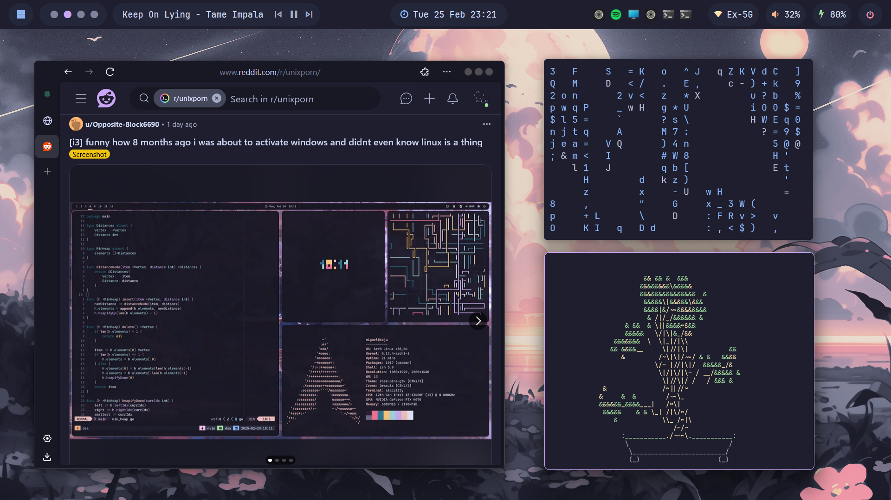                                                              |  |

| **Topbar menu and TUI System Monitor** | **Browser [startpage](https://github.com/ashish0kumar/startpage)** |
| -------------------------------------- | ------------------------------------------------------------------ |
| 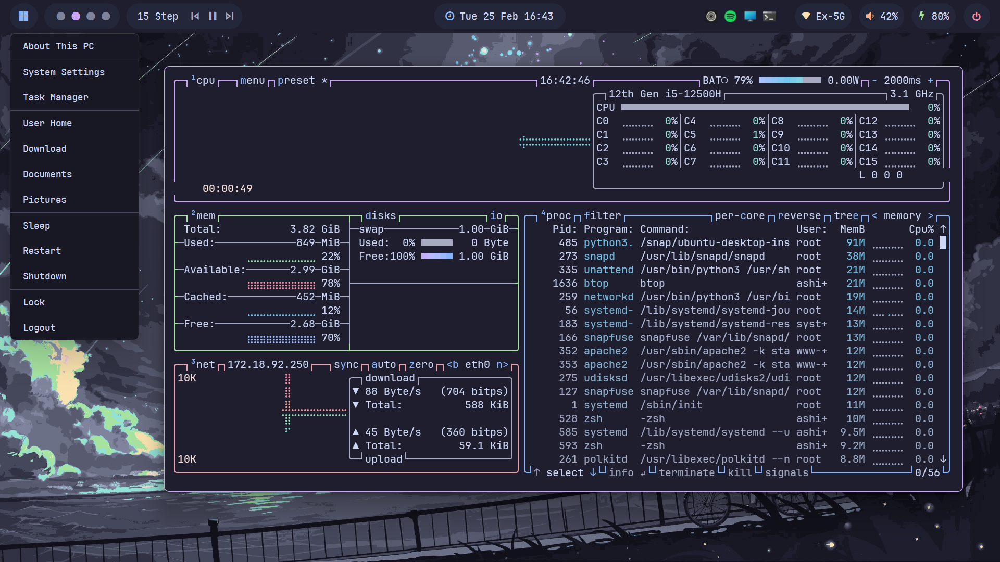                   |                                           |

| **Text Editor**      | **Fuzzy finder preview, ls replacement and cd preview** |
| -------------------- | ------------------------------------------------------- |
|  | 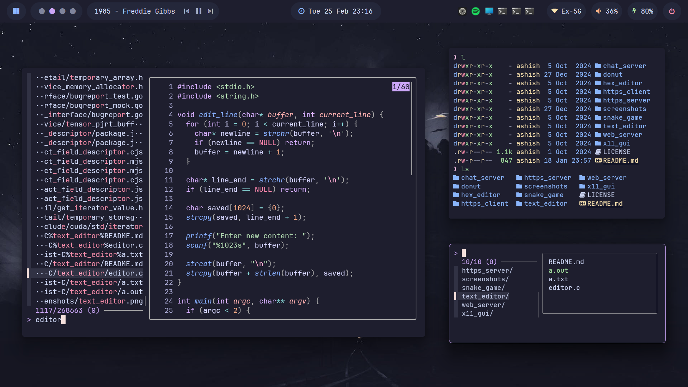                             |

| **TUI File Manager** | **Start Menu, Taskbar and Notification Center** |
| -------------------- | ----------------------------------------------- |
| 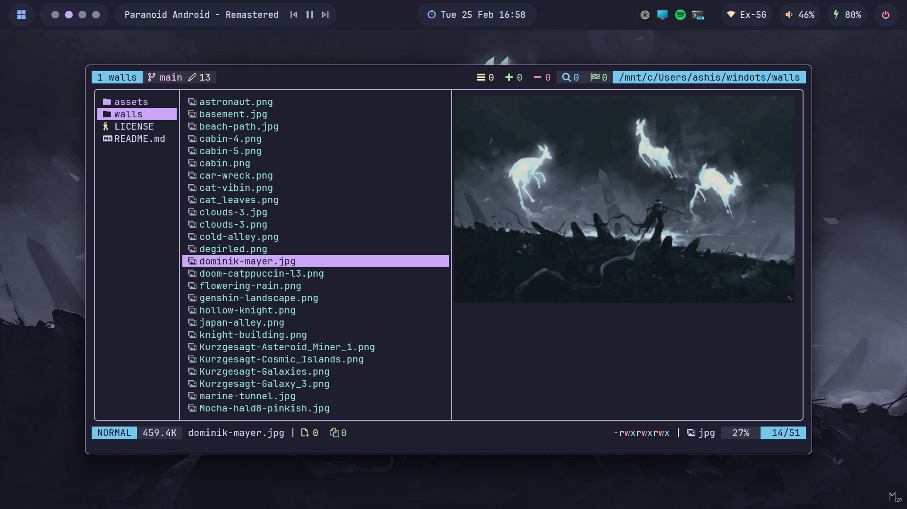 |                         |

| **Topbar Calendar Widget, tty-clock and App Launcher** | **Music Player and CLI Music Visualiser** |
| ------------------------------------------------------ | ----------------------------------------- |
|                               | 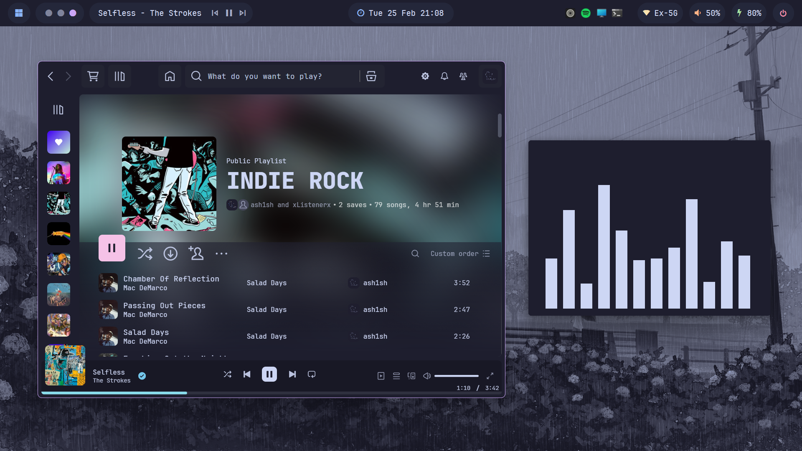                   |

| **Git UI Manager and Telescope find\_files** | **Power Menu**        |
| -------------------------------------------- | --------------------- |
| 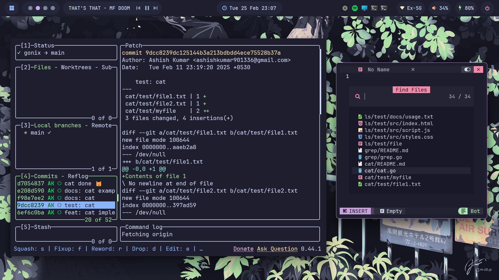                | 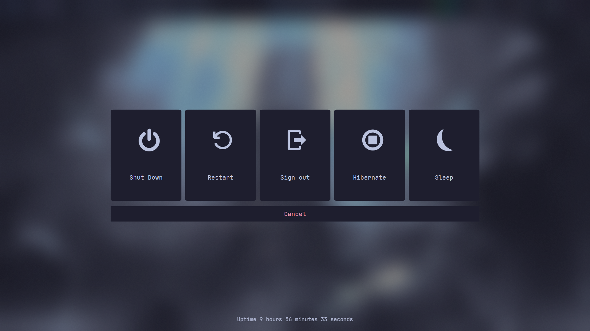 |


---

## 📌 Todo

- [ ] Add an **install script** to set up the configs easily.
- [ ] Write **dedicated README files** inside each config folder with detailed information and usage instructions.

## 📢 Discussions

Have a question, idea, or a cool setup to share? Or maybe you're running into an issue? <br>
Head over to the [Discussions](https://github.com/ashish0kumar/windots/discussions) section.

> [!WARNING]  
> Please open an [issue](https://github.com/ashish0kumar/windots/issues) **only** for reproducible bugs or critical problems. <br>
> For all other help or feedback, [Discussions](https://github.com/ashish0kumar/windots/discussions) is **preferred**.

## 🎉 Credits

Big thanks to all the amazing communities like **r/unixporn**, **r/desktops**, **GlazeWM**, **YASB**, **Komorebi**, **Catppuccin**, and many others whose inspiration and contributions made this project possible!

I wanna point out some resources and projects that helped me the most with the setup:

- [**Matt-FTW**](https://github.com/Matt-FTW/dotfiles) to help me with the overall design of the **README** 🙏
- [**lunar-os**](https://github.com/lunar-os/windowsdesktop2) for the **Start menu windhawk config** 🦅
- [**pivoshenko**](https://github.com/pivoshenko/catppuccin-startpage) for the aesthetic and clean **browser startpage** 🌐
- [**orxngc**](https://github.com/orxngc/walls-catppuccin-mocha) for all the beautiful **catppuccinified wallpapers** 🖼️
- [**GlazeWM**](https://github.com/glzr-io/glazewm) for providing an incredible **tiling window manager** experience that enhances my workflow ✨
- [**YASB**](https://github.com/amnweb/yasb) for a **feature-rich and customizable status bar** that perfectly complements my setup 🚀
- [**Catppuccin**](https://catppuccin.com) for making the **Best Colorscheme** Ever 🖌️


## 💵 Donating

If you want to support my work, please consider donating.
This is optional, but it's always appreciated.

[](https://github.com/sponsors/ashish0kumar)
[](https://buymeacoffee.com/ashish0kumar)

Thank you! 💖

---

## 💫 Star History

[](https://starchart.cc/ashish0kumar/windots)

<br>

<p align="center">
	
</p>

<p align="center">
        <i><code>&copy 2025-present <a href="https://github.com/ashish0kumar">Ashish Kumar</a></code></i>
</p>

<div align="center">
<a href="https://github.com/ashish0kumar/windots/blob/main/LICENSE"></a>&nbsp;&nbsp;
</div>
