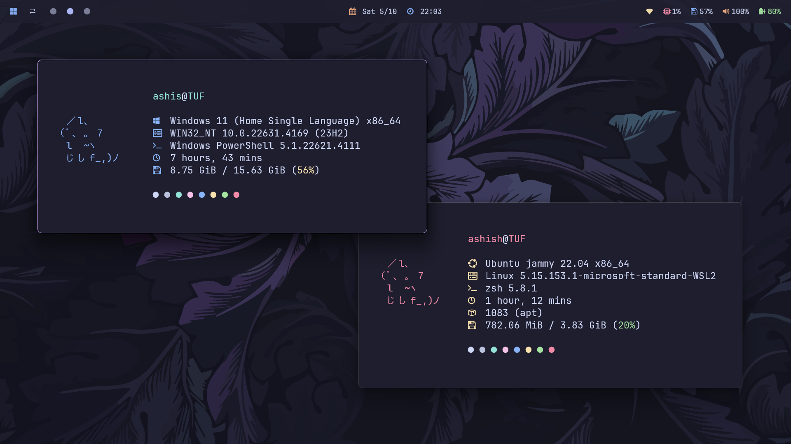
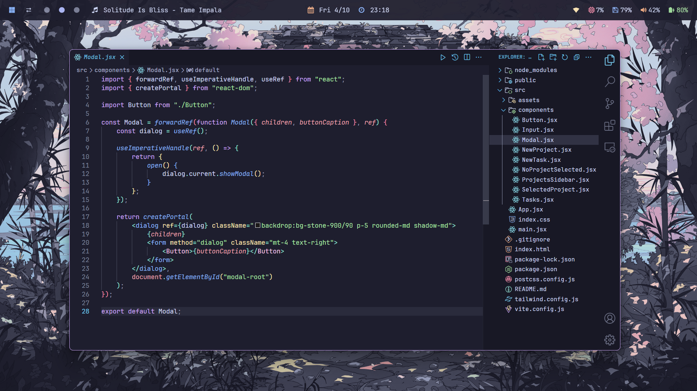
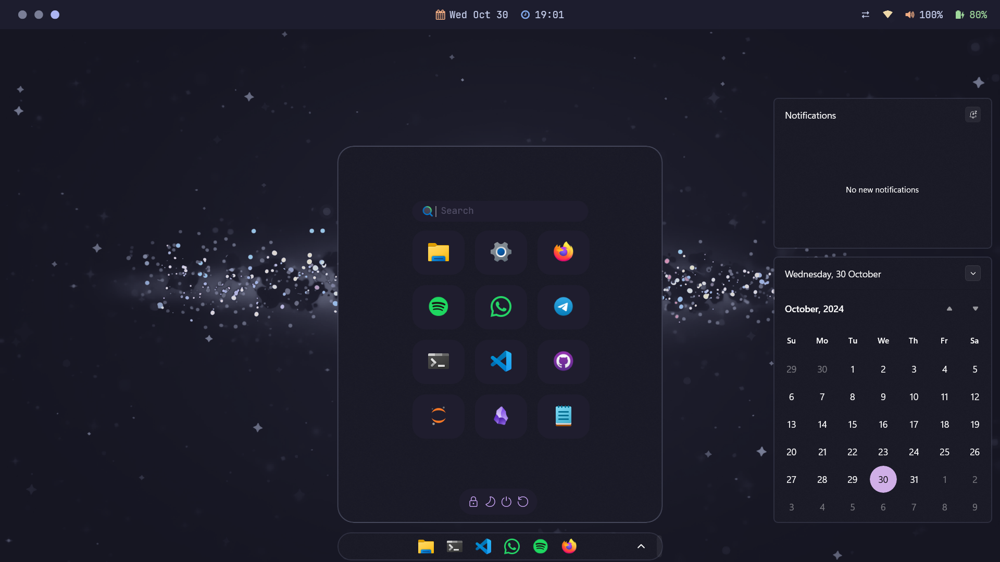
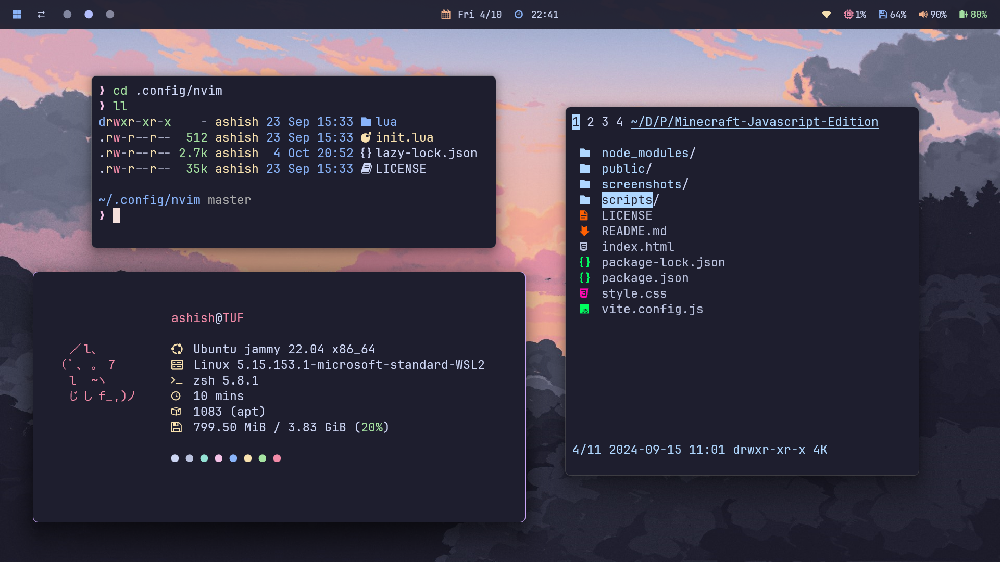
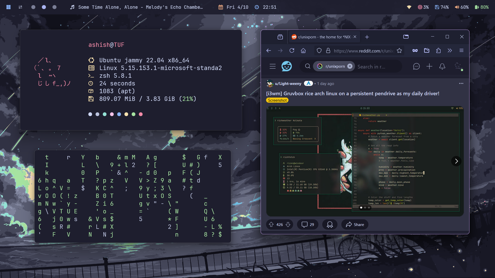
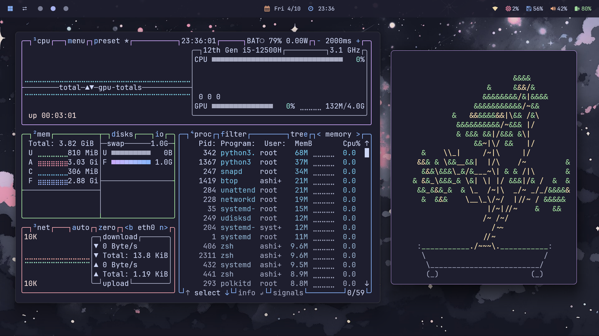
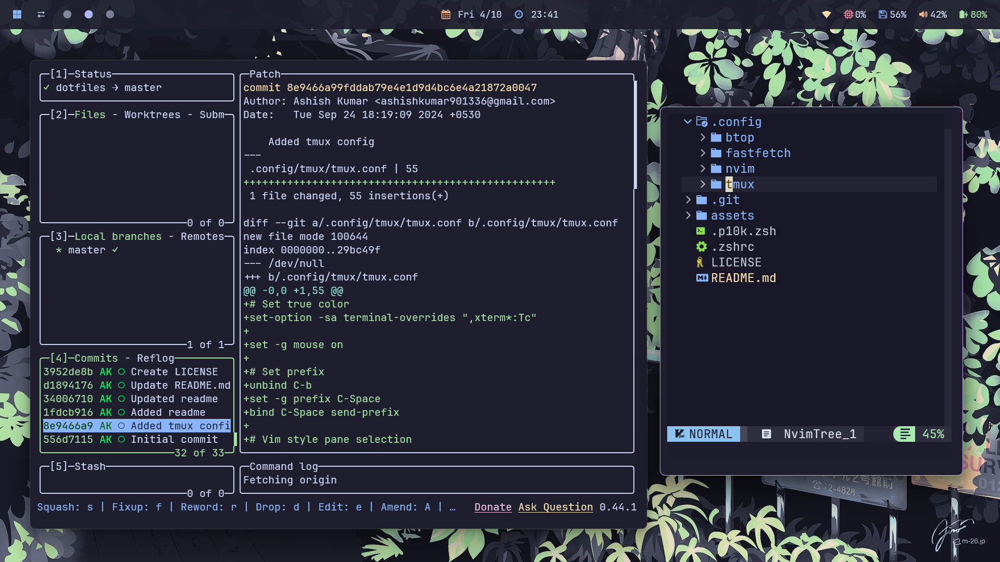
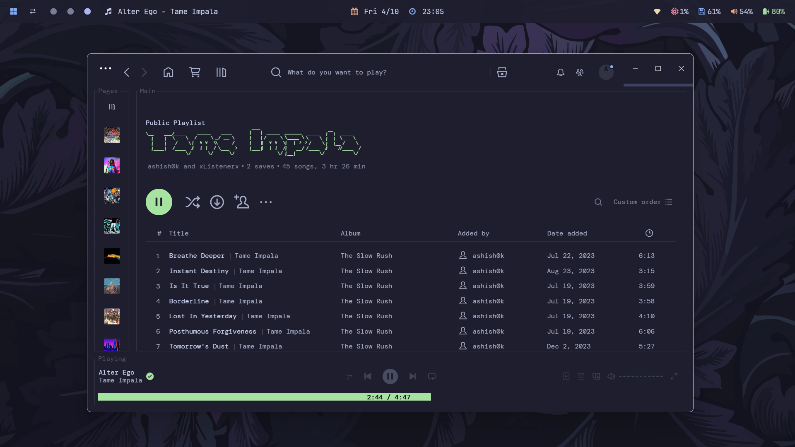
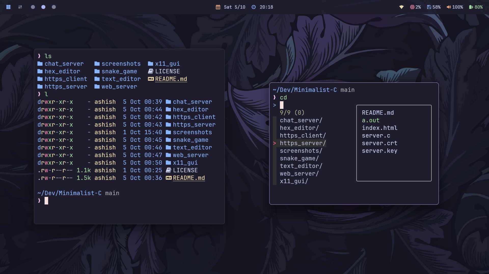
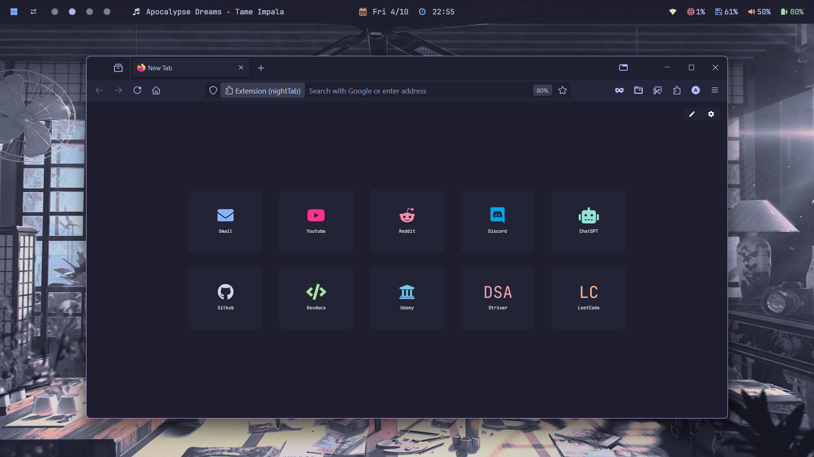

<h1 align="center">🍙 windots</h1>

  <a href="#-about"><kbd>   🌷 About   </kbd></a>&ensp;&ensp;
  <a href="#-setup"><kbd>   🔧 Setup   </kbd></a>&ensp;&ensp;
  <a href="#-gallery"><kbd>   🖼️ Gallery   </kbd></a>&ensp;&ensp;
  <a href="#-credits"><kbd>   🎉 Credits   </kbd></a>&ensp;&ensp;

 

<a href="https://github.com/ashish0kumar/windots/stargazers"><a>&nbsp;&nbsp;
&nbsp;&nbsp;
&nbsp;&nbsp;
&nbsp;&nbsp;

## 🌷 About

#### 💖 For the Ricing and [r/unixporn](https://reddit.com/r/unixporn) Enthusiasts

Welcome Ricers! 👋 If you're a Windows user feeling stuck in your ricing journey and want a setup similar to Unix environments, this collection of dotfiles is for you. Tailored for a Windows setup, these configs will help you elevate your system's aesthetics and functionality to the next level!

> [!NOTE]
> All configurations related to WSL2 (Linux) are maintained in this repository -> [dotfiles](https://github.com/ashish0kumar/dotfiles)

## ✨ Features

- 🪟 Beautiful glaze config
- \>_ Sleek windows terminal config
- 🌸 Minimal VSCode setup
- 🦅 Custom start menu and taskbar
- 🔔 Notification center
- 🚀 Flow launcher config
- 💫 Beautiful [Wallpapers](https://github.com/ashish0kumar/windots/tree/main/walls#readme)

## 🌸 Core System Info

- **OS:** [Windows 11](https://www.microsoft.com/en-in/windows/windows-11) 🪟 + [WSL2](https://learn.microsoft.com/en-us/windows/wsl/) 🐧
- **WM:** [glazewm](https://github.com/glzr-io/glazewm) ✨
- **Shell:** [zsh](https://zsh.sourceforge.io/) 🌾
- **Terminal Emulator:** [windows terminal](https://github.com/microsoft/terminal) >_
- **Panel:** [glaze bar](https://github.com/glzr-io/glazewm) ✨
- **Text Editor:** [vscode](https://code.visualstudio.com/) and [neovim](https://neovim.io/) ⌨️
- **App Launcher:** [flow launcher](https://www.flowlauncher.com/) 🚀
- **File Manager:** [file explorer](https://www.microsoft.com/en-us/windows/tips/file-explorer) / [nnn](https://github.com/jarun/nnn) 📂
- **Browser:** [firefox](https://www.mozilla.org/en-US/firefox/) 🌐
- **Colorscheme:** [catppuccin mocha](https://catppuccin.com/) 🐈🍵

### ℹ️ Whole System Info

Here is all the information about my setup:

> [!Note]
> Some of this apps have the config files included in the repo, which are marked with ⚙️. Also, my favorite programs and tools are marked with 💖.

#### 🖥️ CLI/TUI Apps

| 📚 Entry                           	 | ✨ App                  |
|----------------------------------------|--------------------------|
| **Shell**                              | 💖 [zsh](https://zsh.sourceforge.io/) [⚙️](https://github.com/ashish0kumar/dotfiles/blob/master/.zshrc) |
| **Terminal Emulator**                  | [windows terminal](https://github.com/microsoft/terminal) [⚙️](https://github.com/ashish0kumar/windots/blob/main/.config/terminal/settings.json) |
| **Terminal Multiplexer**               | 💖 [tmux](https://github.com/tmux/tmux) [⚙️](https://github.com/ashish0kumar/dotfiles/blob/master/.config/tmux/tmux.conf) |
| **Shell Prompt**                       | [powerlevel10k](https://github.com/romkatv/powerlevel10k) [⚙️](https://github.com/ashish0kumar/dotfiles/blob/master/.p10k.zsh) |
| **Text Editor**                        | 💖 [neovim](https://neovim.io/) [⚙️](https://github.com/ashish0kumar/dotfiles/tree/master/.config/nvim) |
| **CD Replacement**                     | 💖 [zoxide](https://github.com/ajeetdsouza/zoxide) |
| **LS Replacement**                     | [eza](https://github.com/eza-community/eza) |
| **File Manager**                       | 💖 [nnn](https://github.com/jarun/nnn) |
| **Fuzzy File Finder**                  | 💖 [fzf](https://github.com/junegunn/fzf) |
| **Git TUI**                            | [lazygit](https://github.com/jesseduffield/lazygit) |
| **System Monitor**                     | [btop](https://github.com/aristocratos/btop) [⚙️](https://github.com/ashish0kumar/dotfiles/blob/master/.config/btop/btop.conf) |
| **System Fetch**                       | [fastfetch](https://github.com/fastfetch-cli/fastfetch) [⚙️](https://github.com/ashish0kumar/dotfiles/blob/master/.config/fastfetch/config.jsonc) |
 

#### 🖱️ GUI Apps

| 📚 Entry                           	 | ✨ App                  |
|----------------------------------------|--------------------------|
| **Fallback Text Editorr**              | [VSCode](https://code.visualstudio.com/) [⚙️](https://github.com/ashish0kumar/windots/blob/main/.config/vscode/settings.json) |
| **Music Player**                       | 💖 [Spotify](https://open.spotify.com/) (patched with [Spicetify](https://spicetify.app/)) |
| **Web Browser**               	 | 💖 [Firefox](https://www.mozilla.org/en-US/firefox/) |
| **Note Taking App**                    | 💖 [Obsidian](https://obsidian.md/) |
| **File Manager**                       | [File Explorer](https://www.microsoft.com/en-us/windows/tips/file-explorer) |
| **Office Apps**                     	 | [LibreOffice](https://www.libreoffice.org/) |
 

#### 🔍 Other

| 📚 Entry                             | ✨ App                  |
|---------------------------------------|--------------------------|
| **Colorscheme**                       | 💖 [Catppuccin Mocha](catppuccin.com) |
| **Font**                  		| [JetBrainsMono Nerd Font](https://www.jetbrains.com/lp/mono/) |
| **Dotfiles Manager**              	| 💖 [GNU Stow](https://www.gnu.org/software/stow/) |
 

## 🔧 Setup

### 🪟 GlazeWM

> [!WARNING]
> This setup uses an earlier version of GlazeWM and is not compatible with the latest release.   As a result, it will not work with the new Zebar integration.

To use my GlazeWM setup:

- Install [GlazeWM v2](https://github.com/glzr-io/glazewm/releases/tag/v2.1.1).
- Copy the `windots/.config/.glaze-wm/config.yaml` to your GlazeWM configuration directory:
	- `C:\Users\<Username>\.glaze-wm`
- Restart GlazeWM for the changes to take effect.

### </> Windows Terminal

To apply my custom settings:

- Open Windows Terminal.
- Copy `windots/.config/terminal/settings.json` to the terminal configuration directory:
	-  `C:\Users\<Username>\AppData\Local\Packages\Microsoft.WindowsTerminal_8wekyb3d8bbwe\LocalState\settings.json`
- Restart Windows Terminal to see the updated configurations.

### 📝 VSCode

To use my VSCode settings:

- Install APC Customize UI and catppuccin theme from vscode extensions.
- Copy `windots/.config/vscode/settings.json` to your VSCode user configuration directory:
    - On Windows: `C:\Users\<Username>\AppData\Roaming\Code\User\settings.json`
    - On WSL2: `~/.vscode-server/data/Machine/settings.json`
- Restart VSCode to load the updated settings.

### 🦅 Windhawk

To set up my Windhawk tweaks:
- Install [Windhawk](https://windhawk.net/).
- Copy the Windhawk configuration files from `windots/.config/windhawk/`
- Apply the tweaks from the Windhawk UI.

### 🚀 Flow Launcher

To apply my settings:
- Copy `windots/.config/flowlauncher/Settings.json` to the Flow Launcher config directory:
	-  `C:\Users\<Username>\AppData\Roaming\FlowLauncher\Settings\Settings.json`
- Restart Flow Launcher

## ⌨️ GlazeWM keybindings 

You can always change these in your Glaze config.

| Keys                                                                   | Action                                                          |
|------------------------------------------------------------------------|-----------------------------------------------------------------|
| <kbd>alt</kbd> + <kbd>enter</kbd>                                      | Open terminal                                                   |
| <kbd>alt</kbd> + <kbd>h \| j \| k \| l</kbd>                           | Focus window left \| top \| bottom \| right                     |
| <kbd>alt</kbd> + <kbd>shift</kbd> + <kbd>h \| j \| k \| l</kbd>        | Move focusing window left \| top \| bottom \| right             |
| <kbd>alt</kbd> + <kbd>q</kbd>                                          | Close focusing window                                           |
| <kbd>alt</kbd> + <kbd>1 - 9</kbd>                                      | Focus workspace {n}                                             | 
| <kbd>alt</kbd> + <kbd>shift</kbd> + <kbd>1 - 9</kbd>                   | Move focusing window to workspace {n}                           |
| <kbd>alt</kbd> + <kbd>m</kbd>                                          | Minimize current window                                         |
| <kbd>alt</kbd> + <kbd>x</kbd>                                          | Maximize current window                                         |
| <kbd>alt</kbd> + <kbd>v</kbd>                                          | Change direction where the next window open should be placed    |
| <kbd>alt</kbd> + <kbd>f</kbd>                                          | Make focusing window float/tiled                                |
| <kbd>alt</kbd> + <kbd>shift</kbd> + <kbd>e</kbd>                       | Exit glazewm                                                    |

## 🖼️ ‎Gallery

> [!Note]
> If you want to check the wallpapers, they are available [right here](https://github.com/ashish0kumar/windots/tree/main/walls#readme).

| **TUI File Manager, ls replacement and System Fetch** |
|-------------------------------------------------------|
|  |

| **GUI Text Editor** |
|-------------------------------------------------------|
|  |

| **System Fetch, Matrix Script and Browser on [r/unixporn](https://reddit.com/r/unixporn)** |
|-------------------------------------------------------|
|  |

| **Telescope find_files and pipes script** |
|-------------------------------------------------------|
|  |

| **TUI System Monitor and cbonsai script** |
|-------------------------------------------------------|
|  |

| **Text Editor** |
|-------------------------------------------------------|
|  |

| **Git UI Manager and Text Editor File-tree** |
|-------------------------------------------------------|
|  |

| **Music Player** |
|-------------------------------------------------------|
|  |

| **ls replacement and cd preview** |
|-------------------------------------------------------|
|  |

| **Windows Start Menu and Notification Center** |
|-------------------------------------------------------|
|  |

| **Browser Startpage** |
|-------------------------------------------------------|
|  |

## 📜 License
Feel free to use and modify these dotfiles to suit your needs.

## 🎉 ‎Credits

Big thanks to everyone at [r/unixporn](https://reddit.com/r/unixporn) for inspiring me to make this!

I wanna point out some resources that helped me the most with the setup:

- [Matt-FTW's README](https://github.com/Matt-FTW/dotfiles?tab=readme-ov-file) to help me with the overall design and distribution of the README 🙏
- [GlazeWM](https://github.com/glzr-io/glazewm) for providing an incredible tiling window manager experience that enhances my workflow and productivity ✨
- [lunar-os](https://github.com/lunar-os/windowsdesktop2) for the Windhawk configs 🦅
- [LierB](https://github.com/LierB/fastfetch) for the fastfetch config presets 📋
- [orxngc](https://github.com/orxngc/walls-catppuccin-mocha) for all the beautiful catppuccinified wallpapers 🎨
- [Catppuccin](https://catppuccin.com) for making the Best Colorscheme Ever 🖌️

## ✍️ Contributing

Part of what makes the open source community special are the contributions. Any contributions will be **highly appreciated!**

If you have any ideas or suggestions to make, feel free to [open an issue](https://github.com/ashish0kumar/windots/issues) or [submit a PR](https://github.com/ashish0kumar/windots/pulls)

  

	

